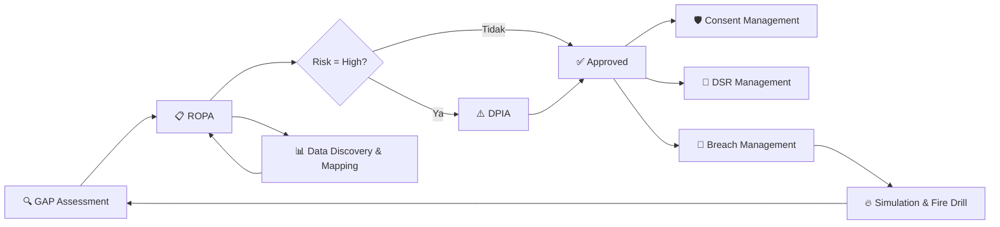
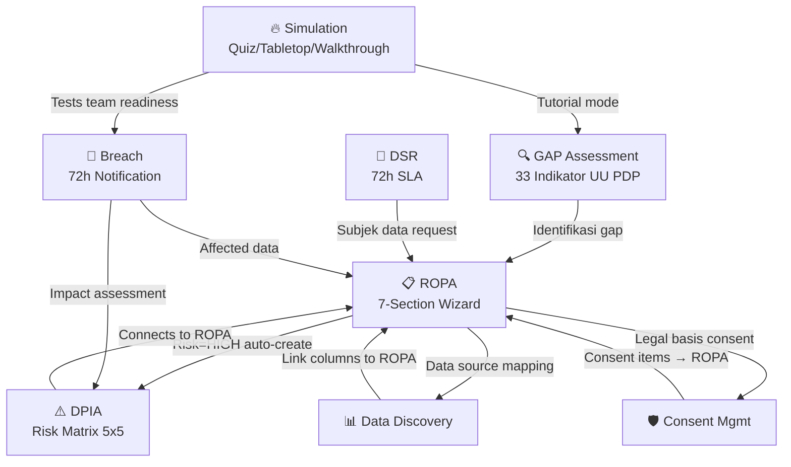

# PRIVASIMU — Platform Architecture & Strategy Document
**Version:** 2.0 | **Date:** 2026-03-26 | **Status:** Definitive

---

## 1. 📋 Proses Bisnis (Business Process)

### 1.1 Compliance Lifecycle Flow


**Lifecycle:**
1. **GAP Assessment** → Evaluasi 33 indikator kepatuhan UU PDP (Tata Kelola + Siklus Proses)
2. **ROPA** → Dokumentasi semua aktivitas pemrosesan data (7 section wizard)
3. **DPIA** → Wajib untuk ROPA high-risk, Risk Matrix 5x5
4. **Data Discovery** → Mapping data source → ROPA (data apa, di mana, siapa akses)
5. **Consent Management** → Collection points + consent items + explorer
6. **DSR** → Permintaan hak subjek data (72h SLA)
7. **Breach** → Incident response (72h notification deadline)
8. **Simulation** → Fire drill rutin untuk kesiapan tim

### 1.2 User Journey per Role
| Role | Journey |
|------|---------|
| **Admin** | Setup org → manage users → configure licenses → monitor compliance |
| **DPO** | GAP Assessment → review ROPA → approve DPIA → handle breach → audit |
| **Maker** | Create ROPA → fill wizard → submit DPIA → respond DSR → log breach |
| **Viewer** | View dashboards → read reports → view assessments |

---

## 2. 🏗️ Arsitektur Teknologi

### 2.1 Tech Stack
```
┌─────────────────────────────────────────────┐
│  FRONTEND (Next.js 15 / React 19)           │
│  - App Router, Server Components            │
│  - Lucide Icons, Vanilla CSS                │
│  Port: 3000                                 │
├─────────────────────────────────────────────┤
│  BACKEND (Laravel 12 / PHP 8.3)             │
│  - Sanctum Token Auth (SPA + API)           │
│  - UUID Primary Keys                        │
│  - Soft Deletes on all models               │
│  Port: 8000                                 │
├─────────────────────────────────────────────┤
│  DATABASE (PostgreSQL — Neon Serverless)     │
│  - Multi-tenant via org_id                  │
│  - JSONB for flexible wizard data           │
│  - Audit logs for all changes               │
└─────────────────────────────────────────────┘
```

### 2.2 API Documentation

#### Auth
| Method | Endpoint | Description |
|--------|----------|-------------|
| POST | `/api/auth/register` | Register user + org |
| POST | `/api/auth/login` | Login → returns token |
| GET | `/api/auth/me` | Current user info |
| POST | `/api/auth/logout` | Revoke token |

#### Dashboard
| Method | Endpoint | Description |
|--------|----------|-------------|
| GET | `/api/dashboard/stats` | KPI aggregation (all modules) |
| GET | `/api/dashboard/charts` | Time-series chart data |

#### Organization
| Method | Endpoint | Description |
|--------|----------|-------------|
| GET | `/api/organization` | Get org details |
| PUT | `/api/organization` | Update org settings |

#### GAP Assessment
| Method | Endpoint | Description |
|--------|----------|-------------|
| GET | `/api/gap` | List assessments |
| GET | `/api/gap/questions` | Get 33-question bank |
| POST | `/api/gap` | Create new assessment |
| GET | `/api/gap/{id}` | Get assessment detail |
| POST | `/api/gap/{id}/submit` | Submit answers + calculate |
| DELETE | `/api/gap/{id}` | Soft delete |
| POST | `/api/gap/{id}/restore` | Restore |
| DELETE | `/api/gap/{id}/force` | Permanent delete |

#### Universal Module CRUD (`/api/m/{module}`)
**Modules:** `ropa`, `dpia`, `dsr`, `consent`, `breach`, `data-discovery`

| Method | Endpoint | Description |
|--------|----------|-------------|
| GET | `/api/m/{module}` | List records (+ `?trash=1`) |
| POST | `/api/m/{module}` | Create record |
| GET | `/api/m/{module}/{id}` | Show record |
| PUT | `/api/m/{module}/{id}` | Update record |
| DELETE | `/api/m/{module}/{id}` | Soft delete |
| POST | `/api/m/{module}/{id}/restore` | Restore |
| DELETE | `/api/m/{module}/{id}/force` | Permanent delete |

**Auto-generated on create:**
- ROPA: `registration_number` (ROPA-YYYY-001), auto-risk from sensitive categories
- DPIA: `registration_number` (DPIA-YYYY-001), auto-create from high-risk ROPA
- DSR: `request_id` (DSR-YYYY-001), `deadline_at` (72h)
- Breach: `incident_code` (BRC-YYYY-001), `containment_checklist`, `timeline_log`
- Consent: `collection_id` (CNT-YYYY-001)

#### Simulation
| Method | Endpoint | Description |
|--------|----------|-------------|
| GET | `/api/simulations` | List sessions |
| GET | `/api/simulations/scenarios` | Get all scenario definitions |
| POST | `/api/simulations` | Create session |
| POST | `/api/simulations/{id}/start` | Start timer |
| POST | `/api/simulations/{id}/submit` | Submit responses |

#### Users
| Method | Endpoint | Description |
|--------|----------|-------------|
| GET | `/api/users` | List users in org |
| POST | `/api/users` | Create user |
| GET | `/api/users/{id}` | Get user |
| PUT | `/api/users/{id}` | Update user |
| DELETE | `/api/users/{id}` | Delete user |

---

## 3. 🔗 Arsitektur Integrasi (Module Relationships)



### Cross-Module Auto-Triggers
| Trigger | Source | Target | Action |
|---------|--------|--------|--------|
| ROPA risk=HIGH | ROPA create/update | DPIA | Auto-create draft DPIA |
| Data spesifik detected | ROPA wizard Section 4 | ROPA | Auto-set risk=HIGH |
| Breach detected | Breach create | Timeline | Auto-init checklist + log |
| DSR received | DSR create | DSR | Auto-set 72h deadline |

---

## 4. 👥 Role & Permission Architecture

### 4.1 Current Roles
DB migration defines: `admin`, `dpo`, `maker`, `viewer`

### 4.2 Recommended Role Matrix

| Feature | SuperAdmin | Admin | DPO | Maker | Viewer |
|---------|-----------|-------|-----|-------|--------|
| **Platform Management** |
| License management | ✅ | ❌ | ❌ | ❌ | ❌ |
| Multi-tenant management | ✅ | ❌ | ❌ | ❌ | ❌ |
| AI feature toggle | ✅ | ❌ | ❌ | ❌ | ❌ |
| **Organization** |
| User management | ❌ | ✅ | ❌ | ❌ | ❌ |
| Role assignment | ❌ | ✅ | ❌ | ❌ | ❌ |
| Org settings / branding | ❌ | ✅ | ❌ | ❌ | ❌ |
| Custom questionnaire | ❌ | ✅ | ✅ | ❌ | ❌ |
| **Compliance** |
| GAP Assessment | ❌ | ✅ | ✅ | ✅ | 👁️ |
| ROPA (create/edit) | ❌ | ✅ | ✅ | ✅ | 👁️ |
| DPIA (create/edit) | ❌ | ✅ | ✅ | ✅ | 👁️ |
| DPIA approve | ❌ | ❌ | ✅ | ❌ | ❌ |
| Breach management | ❌ | ✅ | ✅ | ✅ | 👁️ |
| DSR management | ❌ | ✅ | ✅ | ✅ | 👁️ |
| **Reports** |
| View dashboard | ❌ | ✅ | ✅ | ✅ | ✅ |
| Export PDF reports | ❌ | ✅ | ✅ | ❌ | ❌ |
| Audit log access | ❌ | ✅ | ✅ | ❌ | ❌ |

### 4.3 Role-Based Dashboard & Menu Visibility

**Setiap role melihat menu dan dashboard yang berbeda setelah login:**

| Sidebar Menu | SuperAdmin | Admin | DPO | Maker | Viewer |
|-------------|-----------|-------|-----|-------|--------|
| 🏠 Dashboard | Platform Stats | Org Compliance | Compliance + Alerts | My Tasks | Overview |
| 🔍 GAP Assessment | ❌ | ✅ | ✅ | ✅ | 👁️ Read-only |
| 📋 ROPA | ❌ | ✅ | ✅ | ✅ | 👁️ |
| ⚠️ DPIA | ❌ | ✅ | ✅ (+ Approve) | ✅ | 👁️ |
| 📊 Data Discovery | ❌ | ✅ | ✅ | ✅ | 👁️ |
| 🛡️ Consent Mgmt | ❌ | ✅ | ✅ | ✅ | ❌ |
| 📩 DSR | ❌ | ✅ | ✅ | ✅ | ❌ |
| 🚨 Breach | ❌ | ✅ | ✅ | ✅ | 👁️ |
| 🔥 Simulation | ❌ | ✅ | ✅ | ✅ | ✅ |
| 📄 Docs | ❌ | ✅ | ✅ | ✅ | ✅ |
| ⚙️ Settings | Platform Config | Org + Users | Profile only | Profile only | Profile only |
| 👥 User Management | All tenants | Org users | ❌ | ❌ | ❌ |
| 📜 Audit Logs | All | Org only | Org only | ❌ | ❌ |
| 🔑 License | ✅ | View only | ❌ | ❌ | ❌ |

**Dashboard Widgets per Role:**
- **SuperAdmin:** Total tenants, active licenses, platform health, revenue
- **Admin:** Org compliance score, user activity, pending approvals, module stats
- **DPO:** Compliance score, pending DPIA approvals, active breaches, DSR deadlines, overdue items
- **Maker:** My assigned ROPAs, my pending DSRs, my breach tasks, recent activity
- **Viewer:** Compliance overview (read-only), recent reports, simulation scores

### 4.4 Admin Functions (Answer: YES, admin role is essential)

**Admin (per-tenant/organization):**
- ✅ User management (invite, deactivate, assign roles)
- ✅ Organization settings (name, logo, privacy policy URL)
- ✅ Custom questionnaire (add/modify GAP assessment questions for org-specific compliance)
- ✅ DSR settings (SMTP mailer config, OTP verification, portal URL)
- ✅ Consent widget configuration
- ✅ Audit trail review
- ✅ Export/import data

**SuperAdmin (platform-level, for you as SaaS owner):**
- ✅ License management (activate/deactivate tenants)
- ✅ Package tier management
- ✅ AI feature toggle per tenant
- ✅ Platform analytics (all tenants)
- ✅ Custom question bank management
- ✅ System health monitoring

---

## 5. 💰 Pricing Tier & License Architecture

### 5.1 Package Breakdown

| Feature | 🟢 Starter (Free) | 🔵 Professional | 🟣 Enterprise | 🤖 AI Agent |
|---------|-------------------|-----------------|---------------|-------------|
| **Price** | Rp 0 | Rp 2.5jt/mo | Rp 7.5jt/mo | Rp 15jt/mo |
| **Users** | 3 | 15 | Unlimited | Unlimited |
| **Modules** | GAP + ROPA | All modules | All modules | All modules |
| **ROPA entries** | 10 | 100 | Unlimited | Unlimited |
| **Assessment** | 1 per quarter | Unlimited | Unlimited | Unlimited |
| **Simulation** | Quiz only | All modes | All modes | All modes |
| **Breach** | Basic | Full + templates | Full + templates | Auto-response |
| **DSR** | Manual | + Portal | + Portal + OTP | Auto-process |
| **Consent** | — | Basic widget | Full explorer | Auto-configure |
| **Reports** | — | PDF export | Custom templates | Auto-generate |
| **Audit Trail** | — | 30 days | 1 year | Unlimited |
| **Support** | Community | Email | Dedicated | 24/7 + Agent |
| — | — | — | — | — |
| **🤖 AI Features** | — | — | — | — |
| AI Risk Scoring | ❌ | ❌ | ✅ Basic | ✅ Advanced |
| AI DPIA Writer | ❌ | ❌ | ❌ | ✅ |
| AI Breach Analyzer | ❌ | ❌ | ❌ | ✅ |
| AI Compliance Chat | ❌ | ❌ | ❌ | ✅ |
| AI Agent Autopilot | ❌ | ❌ | ❌ | ✅ |

### 5.2 On-Premise (Beli Putus / Perpetual License)

> Untuk client yang ingin deploy di server sendiri. Harga **satu kali bayar**, include source code & instalasi.

| Komponen | 🟢 Standard (Tanpa AI) | 🔵 Professional (AI Biasa) | 🤖 Ultimate (AI Agent) |
|----------|----------------------|--------------------------|----------------------|
| **Harga Lisensi** | **Rp 75.000.000** | **Rp 150.000.000** | **Rp 350.000.000** |
| **Annual Maintenance** | Rp 15.000.000/thn | Rp 30.000.000/thn | Rp 70.000.000/thn |
| **Users** | Unlimited | Unlimited | Unlimited |
| **Modules** | All 8 modules | All 8 modules | All 8 modules |
| **Data Entries** | Unlimited | Unlimited | Unlimited |
| **Deployment** | On-Premise (Docker) | On-Premise (Docker) | On-Premise (Docker) |
| **Source Code** | ✅ Included | ✅ Included | ✅ Included |
| ─── | ─── | ─── | ─── |
| **🔍 Compliance Engine** | | | |
| GAP Assessment (33 Indikator) | ✅ | ✅ | ✅ |
| ROPA Wizard (7 Section) | ✅ | ✅ | ✅ |
| DPIA (Risk Matrix 5×5) | ✅ | ✅ | ✅ |
| Data Discovery & Mapping | ✅ | ✅ | ✅ |
| Consent Management | ✅ | ✅ | ✅ |
| DSR Management (72h SLA) | ✅ | ✅ | ✅ |
| Breach Management (72h) | ✅ | ✅ | ✅ |
| Simulation & Fire Drill | ✅ | ✅ | ✅ |
| Audit Trail (Riwayat) | ✅ Unlimited | ✅ Unlimited | ✅ Unlimited |
| PDF Report Export | ✅ | ✅ | ✅ |
| Multi-Role (5 Role) | ✅ | ✅ | ✅ |
| ─── | ─── | ─── | ─── |
| **🤖 AI Features** | | | |
| AI Risk Scoring | ❌ | ✅ Basic | ✅ Advanced |
| AI DPIA Auto-Writer | ❌ | ✅ Assisted | ✅ Full Auto |
| AI Breach Response | ❌ | ✅ Suggestion | ✅ Auto-Generate |
| AI Compliance Chat (UU PDP) | ❌ | ✅ Basic Q&A | ✅ RAG + Context |
| AI GAP Recommendation | ❌ | ✅ | ✅ |
| AI DSR Auto-Process | ❌ | ❌ | ✅ |
| AI ROPA Auto-Generator | ❌ | ❌ | ✅ |
| AI Agent Autopilot | ❌ | ❌ | ✅ |
| AI Continuous Monitoring | ❌ | ❌ | ✅ |
| ─── | ─── | ─── | ─── |
| **🛠️ Support & SLA** | | | |
| Instalasi & Setup | ✅ Remote | ✅ Remote + Training | ✅ On-site + Training |
| Training (hari) | 1 hari | 2 hari | 5 hari |
| Bug Fix Support | 6 bulan | 12 bulan | 24 bulan |
| Feature Updates | 6 bulan | 12 bulan | 24 bulan |
| SLA Response | 48 jam | 24 jam | 4 jam |
| Dedicated Account Mgr | ❌ | ❌ | ✅ |

**Annual Maintenance mencakup:**
- Security patches & bug fixes
- Minor feature updates
- Technical support via email/helpdesk
- AI model updates (untuk paket AI)

**Optional Add-ons:**
| Add-on | Harga |
|--------|-------|
| Custom Module Development | Rp 25.000.000+ / modul |
| Custom AI Training (data khusus client) | Rp 50.000.000 |
| Multi-Bahasa (EN/ID/Custom) | Rp 10.000.000 |
| SSO Integration (LDAP/SAML/OAuth) | Rp 15.000.000 |
| Custom Branding (white-label) | Rp 20.000.000 |
| On-site Training (tambahan) | Rp 5.000.000 / hari |
| Dedicated Server Setup | Rp 10.000.000 |

### 5.3 Deployment Models
| Model | Description | Target |
|-------|-------------|--------|
| **SaaS (Cloud)** | Multi-tenant, pdp.privasimu.com | SME, Startup |
| **On-Premise** | Single-tenant, docker deploy | Enterprise, Government |
| **Hybrid** | On-prem data + cloud AI | Regulated industries |

### 5.4 License Activation Flow (On-Premise)
```
1. Customer purchases license → receives activation key
2. Install on-premise → enter key in /admin/license
3. Backend validates key against PRIVASIMU license server
4. Features unlocked based on package tier
5. Periodic heartbeat (monthly) to verify license validity
6. Grace period (30 days) if connection lost
```

---

## 6. 🌟 Unique Selling Points (USP)

### 6.1 Core USPs
| # | USP | Differentiation |
|---|-----|----------------|
| 1 | **🇮🇩 Indonesia-First** | Built specifically for UU No. 27/2022 (UU PDP), not adapted from GDPR |
| 2 | **📋 33-Indicator GAP Assessment** | Official PRIVASIMU framework, not generic compliance checklist |
| 3 | **🔗 Auto-Connected Modules** | ROPA auto-triggers DPIA, breach auto-generates notification, DSR auto-SLA |
| 4 | **🔥 Built-in Fire Drill** | Only PDP platform with integrated simulation (Quiz + Tabletop + Walkthrough) |
| 5 | **🤖 AI Agent Mode** | AI can autonomously manage compliance: auto-fill ROPA, auto-assess risk, auto-respond DSR |
| 6 | **📊 Real-Time Compliance Score** | Live dashboard showing compliance progression, not just static reports |
| 7 | **🏢 On-Premise Ready** | Can deploy locally for high-security environments (government, banking) |

### 6.2 AI Agent Capabilities (Premium USP)
| Capability | Description |
|------------|-------------|
| **Auto-ROPA Generator** | AI reads data sources → auto-generates ROPA entries with correct categories |
| **Smart Risk Scoring** | AI analyzes data combinations → predicts risk level → auto-triggers DPIA |
| **DPIA Auto-Writer** | AI fills Risk Register based on ROPA data + industry benchmarks |
| **Breach Response Agent** | AI auto-generates containment steps, notification letters, timeline |
| **DSR Auto-Process** | AI verifies identity, maps data locations, auto-generates response |
| **Compliance Chat** | Natural language Q&A about UU PDP requirements (RAG-based) |
| **Continuous Monitoring** | AI periodically re-assesses GAP, flags new risks, suggests actions |

### 6.3 Competitive Landscape
| Competitor | Weakness | PRIVASIMU Advantage |
|-----------|----------|-------------------|
| OneTrust | GDPR-focused, expensive, no UU PDP | Built for UU PDP, affordable |
| TrustArc | US-centric, complex | Simple wizard, bahasa Indonesia |
| Securiti.ai | AI but no local compliance | UU PDP + AI Agent |
| Manual spreadsheet | No automation, error-prone | Full automation + audit trail |

---

## 7. 📁 Database Schema (Current)

### Tables
| Table | Purpose | Key Relationships |
|-------|---------|-------------------|
| `organizations` | Multi-tenant org | has many users, ROPA, etc |
| `users` | Auth + roles | belongs to org |
| `gap_assessments` | 33-question compliance | belongs to org |
| `ropas` | Processing activities | belongs to org, has DPIA |
| `dpias` | Impact assessments | belongs to org, has ROPA |
| `dsr_requests` | Subject rights | belongs to org |
| `breach_incidents` | Security incidents | belongs to org |
| `consent_collection_points` | Consent widgets | belongs to org, has items |
| `consent_items` | Individual consents | belongs to collection |
| `consent_records` | User consent logs | belongs to collection |
| `information_systems` | Data sources | belongs to org |
| `breach_simulations` | Fire drill sessions | belongs to org |
| `audit_logs` | Change tracking | polymorphic to all modules |

---

## 8. 🗺️ Implementation Roadmap (Updated)

### Phase 1: Core Wizard ✅ In Progress
- [x] GAP Assessment — 33 questions, official codes
- [x] ROPA — 7-section wizard (matching live site)
- [x] Simulation — 17 scenarios (Quiz + Tabletop + Walkthrough)
- [ ] DPIA — 3-step wizard

### Phase 2: Admin & Roles
- [ ] Admin dashboard with user management
- [ ] Role-based access control middleware
- [ ] Organization settings page
- [ ] Custom questionnaire editor (admin can add/modify GAP questions)

### Phase 3: Integration Layer
- [ ] Cross-module linking (ROPA ↔ DPIA ↔ Consent ↔ Data Mapping)
- [ ] Audit trail UI (Lihat Riwayat)
- [ ] DSR Settings + public portal
- [ ] Consent Explorer

### Phase 4: AI Features
- [ ] AI Risk Scoring engine
- [ ] AI DPIA writer
- [ ] Compliance chatbot (RAG on UU PDP)
- [ ] AI Agent autopilot mode

### Phase 5: Enterprise
- [ ] License management system
- [ ] On-premise deployment (Docker)
- [ ] PDF report generation
- [ ] Multi-language support
